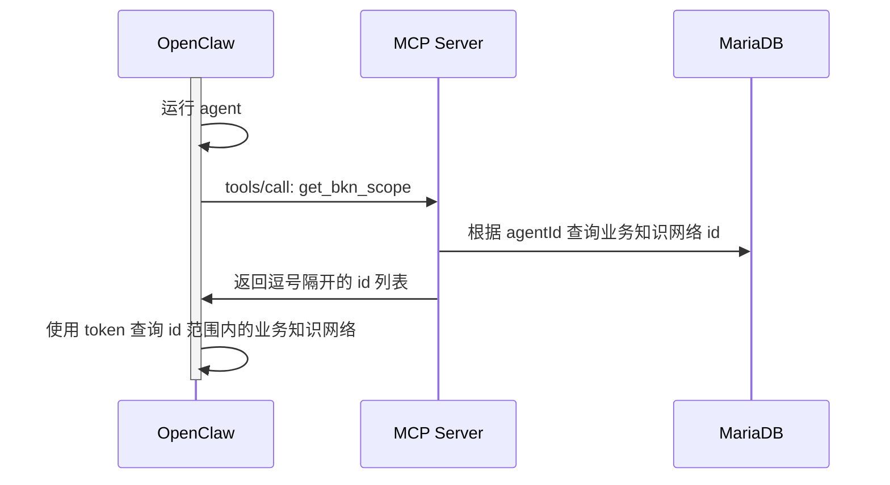

# MCP

DIP Studio MCP Server 用于向 OpenClaw 提供运行过程中所需的上下文。

OpenClaw 通过 `mcporter` 技能来访问 DIP Studio MCP Server 暴露的工具。

## 术语

**BKN**

业务知识网络。一种包含对象、逻辑、行动的知识图谱。

## MCP Server 设计

### tools

DIP Studio MCP Server 提供以下 tools：

#### get_kweaver_base_url

获取 KWeaver 服务连接地址。连接地址需要配合 KWeaver Token 一起使用。

#### get_kweaver_token

获取指定数字员工的 KWeaver Token。业务流程如下：

#### get_bkn_scope

获取指定数字员工的业务知识网络范围。业务流程如下：

