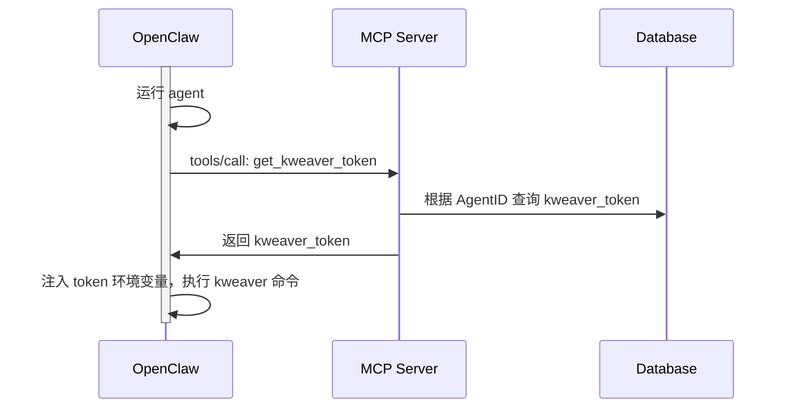

# MCP

DIP Studio MCP Server 用于向 OpenClaw 提供运行过程中所需的上下文。

## MCP Server 设计

### tools

DIP Studio MCP Server 提供以下 tools：

#### get_kweaver_token

获取指定数字员工的 KWeaver Token。业务流程如下：

```mermaid
sequenceDiagram 

participant OC as OpenClaw
participant MCP as MCP Server
participant DB as Database

activate OC
  OC ->> OC: 运行 agent
  OC ->> MCP: tools/call: get_kweaver_token
  MCP ->> DB: 根据 AgentID 查询 kweaver_token
  MCP ->> OC: 返回 kweaver_token
  OC ->> OC: 注入 token 环境变量，执行 kweaver 命令
deactivate OC

```
