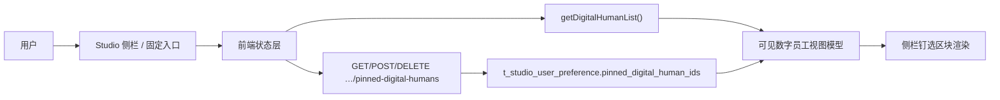
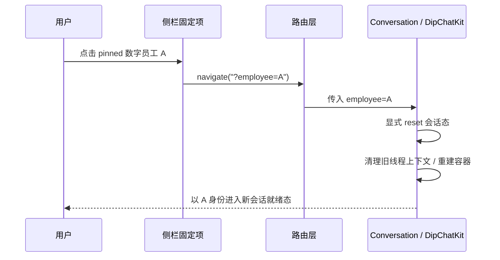
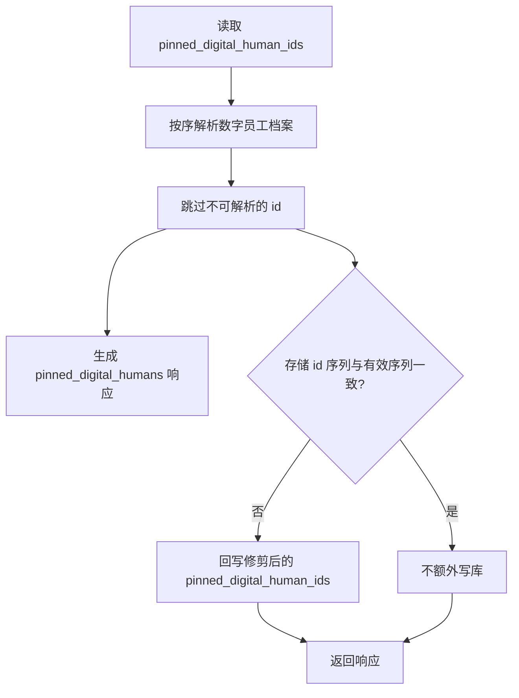

# Issue #167：侧边栏固定常用数字员工 — 逻辑设计

| 项 | 内容 |
|----|------|
| **Issue** | [kweaver-ai/kweaver-dip#167](https://github.com/kweaver-ai/kweaver-dip/issues/167) |
| **文档路径** | `design/feature/studio/pinned-digital-humans-sidebar.md` |
| **文档类型** | 逻辑设计：**需求分析** + **实现分析** |
| **状态** | 评审稿 |
| **说明** | 本文不写具体代码与文件级改动清单；实现分析描述技术方案与契约，供开发联调。 |

---

# 第一部分：需求分析

面向产品、测试与评审：**要解决什么问题、用户要什么、如何验收**，不绑定具体接口路径与模块名（仅在必要时用业务用语指代）。

---

## 1.1 背景与问题

用户在首页、会话等场景中需要频繁在多个**数字员工**之间切换；当前主要依赖选择器或列表进入，路径较长。Issue 要求：用户可将**常用**数字员工**固定到 Studio 侧边栏**，通过侧栏**一键切换**，降低操作成本。

---

## 1.2 用户场景（典型）

| 场景 | 期望行为 |
|------|----------|
| 常驻协作 | 用户希望 2～3 个高频数字员工始终在侧栏可见，无需每次打开选择器。 |
| 快速起聊 | 从侧栏点击某员工后，应能**尽快**以该员工身份进入可对话状态（见 1.4 中「新会话」约定）。 |
| 多端办公 | 同一账号在另一浏览器或设备登录时，固定列表**应保持一致**（需服务端持久化，属实现分析 §2.2）。 |
| 纠错 | 用户可取消固定；列表与心中预期一致，无「取消了仍显示」等明显错误。 |

---

## 1.3 功能需求与验收标准

1. **可固定**：用户能将当前可选范围内的某一数字员工加入「侧栏固定列表」（入口可在数字员工管理或会话上下文，**至少一处**即可满足本期；具体入口属实现排期）。  
2. **可展示**：侧栏展示固定项，至少包含**可辨识的名称**与**图标**（若有）；名称过长时**截断**或省略，不撑破布局。  
3. **可切换**：用户点击侧栏某一固定项后，进入**会话能力**，并以该员工身份就绪；**语义上等同「用该员工新开对话」**（见 1.5）。  
4. **可取消固定**：用户能移除某项；移除后侧栏与「已保存的偏好」一致。  
5. **持久化**：固定列表在**刷新、重新登录同一账号**后仍保留；与「仅存在浏览器本地、清缓存即丢」的体验相比，应达到**账号级**粘性（由实现分析中的后端方案承载）。  

---

## 1.4 非目标（本期不做）

- 侧栏内**拖拽改变顺序**（顺序可由服务端列表顺序表达，本期不要求用户自定义排序）。  
- 在侧栏展示**未读数、任务状态**等复杂状态（除非与现有聊天框架天然一致且不额外引入大改）。  
- 改造数字员工**后台配置、权限模型**的业务规则；本期仅消费「谁能看见哪些员工」的**现有结果**做展示过滤。  

---

## 1.5 业务规则与体验约定

| 规则 | 说明 |
|------|------|
| **列表顺序** | 侧栏自上而下为**按添加时间倒序**：**最近**钉选/固定的项显示在**最上**；持久化数组 `pinned_digital_human_ids` 的**第 1 个元素**对应侧栏**最上**一格，以此类推。本期不提供用户拖拽排序。 |
| **「新会话」语义** | 从侧栏点进某员工时，**不延续**用户此前在**另一员工**下未完成会话的 `sessionKey`；与从首页选员工进会话的直觉一致。若已在会话页仅切换 `employee`，实现上必须有**显式会话重置机制**（如重建会话容器实例、清理当前线程态或注入新的 `conversationKey`），以保证语义上等同「用该员工新开对话」；不能仅依赖 query 变化碰巧触发。 |
| **幂等** | 同一员工被多次「固定」不应产生重复条目。 |
| **上限** | 固定数量上限为 **8**；该值以侧栏可稳定展示与快速切换为准，而非存储能力上限。超出时需**明确提示**用户，而非静默失败。 |
| **失效数据** | 偏好里曾钉选、但数字员工已删除或档案不可加载的 id：**不在**钉选接口的 `pinned_digital_humans` 中返回；服务端在 `GET`/`POST`/`DELETE` 组合或变更时**剔除**并在存储中**修剪**对应的 id，避免占上限或需单独「失效行」交互（与 §2.6 对齐）。 |
| **侧栏折叠** | 侧栏折叠时，固定区行为应与现有 Studio 侧栏其它扩展区块**一致**（如不展开长列表），避免挤占图标栏。 |
| **国际化** | 区块标题、固定/取消、错误提示等需支持项目已提供语言（至少中英）。 |

---

## 1.6 体验与可访问性（需求层）

- **视觉**：与侧栏内「工作计划」「历史会话」等区块**层级协调**（标题、间距、hover），不显得像临时补丁。  
- **可访问性**：关键操作为键盘/读屏可用（具体 aria 由实现补齐）。  

---

## 1.7 术语表（需求视角）

| 术语 | 含义 |
|------|------|
| 数字员工 | 产品中用户可对话的 Agent 实例；在系统中有唯一标识（id）。 |
| 固定 / 钉选 | 将某数字员工 id 记入「我的侧栏快捷列表」并展示。 |
| 侧栏 | 本文指 DIP Studio 场景下的左侧导航（含会话入口与各区块）。  

---

## 1.8 需求追溯小结

| Issue 表述 | 对应需求章节 |
|------------|----------------|
| 固定常用的数字员工到侧边栏 | 1.3-1、1.3-2 |
| 快速切换 | 1.3-3、1.2 |
| （隐含）多端一致 | 1.2、1.3-5 |  

---

# 第二部分：实现分析

面向开发与架构：**在现有系统内如何实现、数据走哪、模块如何切分、风险与测试**，与第一部分验收口径对齐。

---

## 2.1 现状与约束

| 域 | 现状要点 | 对实现的约束 |
|----|----------|----------------|
| 会话入口 | `Home` → `/studio/conversation?employee=…`；`Conversation` 将 `employee` 传给 `DipChatKit`。 | 侧栏固定项点击须**对齐**同一查询参数契约。 |
| 侧栏 | `HomeSider` / `AdminSider` 在具备 studio 模块时结构对称；含 `StudioMenuSection`、工作计划块、历史会话块等。 | 新分区须**两处**同时接入。 |
| 微应用钉选 | `StoreMenuSection` + `preferenceStore`：applications 列表过滤 `pinned`，单项 `PUT …/applications/{key}/pinned`。 | 数字员工**不能**复用该 API（资源为应用安装实例，非「每用户员工列表」）；可**复用交互范式**（钉/拔钉、token 后拉取）。 |

---

## 2.2 持久化方案选型

**结论**：采用 **dip-studio 钉选数字员工 HTTP 资源 + 库表 `t_studio_user_preference`**（每用户一行），仅包含 **`user_id`** 与 **`pinned_digital_human_ids`**（JSON 数组，顺序即展示）及 **`updated_at`**；**不设**通用 `content` JSON 列。对外路径 **`/api/dip-studio/v1/pinned-digital-humans`**。

**理由摘要**：

- 本期范围仅为侧栏钉选列表，行级-schema 足够；避免预留空列增加迁移与语义歧义。  
- 若未来存在其它 Studio 级用户偏好，可另建表或另开资源，避免与钉选混在同一行「半结构化 JSON」内。  
- 对外接口归属 **dip-studio**，与现有数字员工、会话等边界一致。  

**已知限制**：本期仍接受钉选列表上的**最后写入为准**（last write wins）；暂不实现版本号/ETag 冲突控制，但写入成功后前端需**立即按服务端返回或重新 GET 的快照回显**，避免客户端停留在过期本地态。

### 2.2.1 为什么本期仍使用数据库，而不是文件系统

本期评审中曾讨论是否像 OpenClaw 的部分能力一样，直接依赖文件系统存储 pinned 偏好。结论是不采用文件系统方案，主要考量如下：

- **数据语义是“当前登录用户偏好”**：该数据按 `user_id` 隔离，服务于“当前用户在 Studio 中固定哪些数字员工”，不属于某个数字员工 workspace，也不属于某台 OpenClaw 节点的局部运行时文件。  
- **需求显式要求多端一致**：需求 1.2 / 1.3-5 要求同一账号在不同浏览器、不同设备登录时保持一致。若落文件系统，除非所有 Studio 实例共享同一持久卷且有稳定的多副本写入协调，否则天然更接近“单机本地偏好”，与需求不匹配。  
- **部署形态更稳妥**：数据库天然适合承载用户级小型结构化偏好，备份、迁移、排障都比散落在本地文件更直接；文件方案会额外引入目录规划、权限控制、原子写入、锁竞争、共享存储一致性等问题。  
- **现有 OpenClaw 文件能力的语义不同**：技能目录、workspace 文件、`PLAN.md`、`openclaw.json` 等更偏 agent/workspace 资产或节点配置；本需求中的 pinned 列表是 Studio 业务偏好，直接类比为“也走文件系统”会混淆边界。  
- **实现复杂度与收益不匹配**：本期 pinned 数据结构极小、访问频率低，数据库方案已经足够简单；若为此改走文件系统，并不能明显降低复杂度，反而会增加多实例与并发写入风险。  

因此，本期采用 **Studio API + 数据库存储** 的方案：对外接口归属 `dip-studio`，对内使用仅承载钉选列表的 `t_studio_user_preference`。**不设**与钉选无关的宽表 JSON 列；其它偏好若进版则单独设计表或接口。

### 2.2.2 方案关系图



---

## 2.3 数据模型与接口契约

### 2.3.1 存储

- **表**：`t_studio_user_preference`（每用户一行，仅存钉选）  
- **主键**：`user_id`（与 `UserInfo.id` / 登录主体一致）  
- **列**：`pinned_digital_human_ids`（JSON 数组或等价类型，有序；存 `string[]`）；`updated_at`（更新时间）  
- **数量上限**：数组长度 `<= 8`（业务规则见 §1.5，由服务端校验）  
- **顺序**：数组顺序 = 侧栏自上而下；其中 **index 0 = 最近添加**、**最后一个 = 最早仍保留的钉选**（即「按添加时间倒序」）。用户**新钉选**时客户端调用 **`POST`，请求体只带一个** `pinned_digital_human_id`，由服务端将该 id **置顶**；无排序 UI 时**不擅自**本地重组整表再提交。取消钉选使用 **`DELETE …/{id}`**。

### 2.3.2 HTTP 契约（摘要）

| 方法 | 路径 | 语义 |
|------|------|------|
| `GET` | `/api/dip-studio/v1/pinned-digital-humans` | 返回当前用户侧栏钉选；响应体 `pinned_digital_humans` 为服务端**已组合** name/icon 等后的有序列表；无记录等价于 `pinned_digital_humans: []`。 |
| `POST` | `/api/dip-studio/v1/pinned-digital-humans` | 请求体**仅一个** `pinned_digital_human_id`：将该 id **钉选并置顶**（幂等：已存在则先去重再前置）；超出 8 个**不同** id 时 400；成功响应为组合后的 `pinned_digital_humans`。 |
| `DELETE` | `/api/dip-studio/v1/pinned-digital-humans/{id}` | 取消对该 id 的钉选（未钉选则幂等）；成功响应同 `GET`。 |

**POST 请求体示例**（单个 id；服务端写入时仍会按可解析结果修剪整表）：

```json
{
  "pinned_digital_human_id": "<id>"
}
```

**GET / POST / DELETE 成功响应示例**（展示数据由服务端组合，前端**不得**仅用 id 再调全量列表接口拼装侧栏）：

```json
{
  "pinned_digital_humans": [
    {
      "id": "<id-1>",
      "name": "<名称>",
      "creature": "<岗位可选>",
      "icon_id": "<图标可选>"
    }
  ]
}
```

已删除或档案不可加载的钉选 id **不会**出现在 `pinned_digital_humans` 中；服务端会在 `GET`/`POST`/`DELETE` 时将该 id 从持久化数组中**剔除**或**不再写入**（修剪存储），侧栏列表仅展示仍存在的员工。

**约定说明**：

- `POST` 仅提交 **`pinned_digital_human_id` 一个字段**：服务端把该 id **置顶**到 `pinned_digital_human_ids` 首部（倒序语义见 §1.5）；新增第 9 个**不同** id 时返回 400。  
- `GET` / `POST` / `DELETE` 成功响应均以 `pinned_digital_humans` 为侧栏渲染的**权威展示数据**（服务端已从数字员工档案组合 name/icon 等；**不含**已删除/不可解析项）。  
- 当存储中仍含无效 id 时，`GET` 会在组合后**回写**修剪后的 `pinned_digital_human_ids`。**`POST` 在置顶合并后**仍会按可解析结果写回存储；**`DELETE`** 直接去掉路径中的 id 后再组合写回。  
- 持久化列仍为 `pinned_digital_human_ids` 的 JSON 数组；组合与过滤逻辑在 dip-studio 内完成。

### 2.3.3 服务端校验（实现约定）

- `POST` 请求体单个 id 的 trim、最大长度与**钉选后 distinct 数 ≤8** 由服务端校验；档案不可解析时返回错误且不置顶。  
- 组合钉选响应时，dip-studio 对无法加载的数字员工 id **直接跳过**，并在与存储不一致时**修剪** `pinned_digital_human_ids`；不在响应中保留「仅 id、无档案」的占位行。

### 2.3.4 客户端更新模式

- **添加**：`POST`，`{ "pinned_digital_human_id": "<新 id>" }`（一次仅一个 id；服务端置顶）；**以响应体中的 `pinned_digital_humans` 更新展示**。  
- **移除**：`DELETE /pinned-digital-humans/{id}`；**以响应体中的 `pinned_digital_humans` 更新展示**。  
- **写后回显**：以 `POST` / `DELETE` 响应体或紧随其后的 `GET` 结果覆盖本地缓存，不依赖本地推断结果长期驻留。  
- **拉取时机**：每 **token 会话**至少拉取一次；可选与 `fetchPinnedMicroApps` 类单飞策略对齐；窗口聚焦刷新按需、需防抖。

---

## 2.4 核心流程（实现步骤）

### 2.4.1 进入页 / 刷新后有固定项

1. `GET /api/dip-studio/v1/pinned-digital-humans` 得 `pinned_digital_humans`（仅含仍可解析的数字员工；已删除项已从响应与存储侧栏视图中消失）。  
2. 直接渲染侧栏区块组件（如 `PinnedDigitalHumansSection`）；**无需**再拉全量数字员工列表仅为拼装钉选区展示。

### 2.4.2 点击侧栏固定项

1. `navigate('/studio/conversation?employee=<id>')`，**不带** `sessionKey`。  
2. 路由层或聊天容器层在检测到“来源于 pinned 员工切换”后，必须显式**重置当前会话态**，保证不会复用上一员工的线程上下文。  
3. 由现有 `Conversation` / `DipChatKit` 承接；需回归「仅 query 变更」时的 reset 行为。



### 2.4.3 固定 / 取消固定

1. 固定：`POST`，请求体 `{ "pinned_digital_human_id": "<当前员工 id>" }` → 以响应 `pinned_digital_humans` 为准。  
2. 取消：`DELETE …/pinned-digital-humans/<id>` → 以响应为准。
3. 可选乐观更新 + 失败回滚。  
4. 成功后以服务端最新快照覆盖本地状态；若发现返回结果与预期不一致，以服务端为准。

**说明**：失效钉选 id 的清理由 **dip-studio 钉选接口在组合时同步修剪存储** 完成；前端不必再实现单独的「失效项异步清理」链路，除非产品需要与钉选域之外的列表强一致时的补充策略。

---

## 2.5 前端模块划分

| 模块 | 职责 |
|------|------|
| 状态层 | 缓存 `pinned_digital_humans` 快照；通过 `POST`（单 id 置顶）与 `DELETE` 维护列表；与 token 生命周期对齐。 |
| 侧栏区块 | 列表 UI、空态隐藏、折叠与 `WorkPlanSection` 等一致。 |
| 固定入口 | 列表或会话内至少一处；调状态层。 |
| 路由 | 只消费 `employee`，不持久化偏好。 |

**建议插入位置**：`StudioMenuSection` **之下**、工作计划区**之上**；两处侧栏保持一致。

---

## 2.6 降级、错误与安全

| 场景 | 策略 |
|------|------|
| 偏好 id 指向已删除员工 | 钉选 API **不返回**该项；`GET` 时修剪存储中的 id，**不占**钉选名额；前端侧栏不出现「失效行」，也无需单独移除交互。 |
| 员工列表接口失败 | 可暂存 id；降级为缩写 id、隐藏区块或 toast。 |
| 偏好接口失败 | 与现有 `preferenceStore` 风格一致的错误提示。 |
| 鉴权 | Bearer token；与 dip-studio 其它受保护路由一致（经网关时与同产品其它 API 对齐）。 |
| 权限 | 「固定」≠ 管理权限；钉选接口返回的项均可解析为当前有效数字员工。列表/权限与钉选存储不一致时的边界以现有员工可见性规则为准。 |

### 2.6.1 钉选组合与存储修剪（概念）



---

## 2.7 测试要点

| 层级 | 要点 |
|------|------|
| 服务 | 单 id 校验、上限 **8**、`GET`/`POST`/`DELETE` 组合时剔除无效 id 并修剪存储。 |
| 前端状态 | pin 幂等、unpin 一致、换 token 重拉、写后按服务端快照覆盖本地。 |
| E2E / 手工 | URL `employee` 正确；无错误续用旧 `sessionKey`；切换 pinned 员工后会话容器确实 reset。 |
| 异常数据 | 无效钉选 id 由服务端在钉选接口侧过滤；侧栏不出现「仅 id、无档案」占位行；名额不被脏 id 占用。 |
| 并发 | 两端近同时编辑时接受最后写入覆盖，但成功写入后 UI 必须回显服务端最终结果。 |
| 回归 | `HomeSider` / `AdminSider` 行为一致；折叠布局。 |

---

## 2.8 实施阶段与风险

**建议顺序**：状态层 + API 联调 → 侧栏只读 + 跳转 → 固定/取消入口 → i18n、a11y。

**风险**：同一钉选列表在多端并发编辑时仍可能被后写覆盖；本期通过「**单 id POST 置顶 + DELETE 取消 + 写后服务端快照回显**」降低体感错误，但不解决真正的冲突检测。另一个关键约束是 pinned 上限 **8** 与侧栏承载能力强绑定；若后续产品希望支持更多固定项，需同时补“展开更多 / 独立管理面板 / 自定义排序”等交互，而不是单独放宽上限。

---

## 2.9 实现侧自检清单

- [ ] 需求 1.3 五项均可追溯至实现或测试用例。  
- [ ] 用户级存储与微应用钉选域分离清晰。  
- [ ] GET→POST（单 id）/ DELETE→回显 模式在 PR 说明或代码注释中可追溯。  
