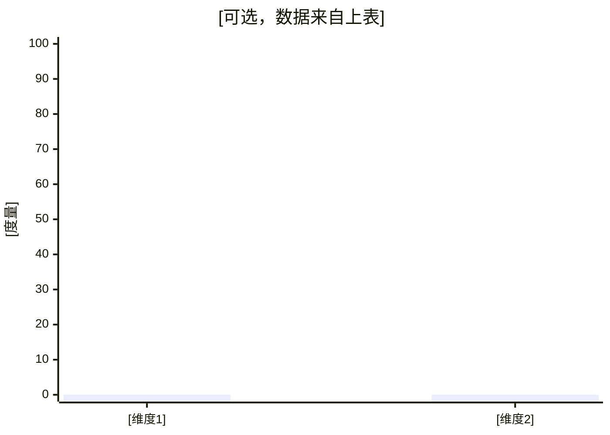

# 归因分析报告模板（`attribution_analysis_report`）

> 规范见 [`../references/smart-reporting.md`](../references/smart-reporting.md)「C. 归因分析报告框架」。仅消费 **`smart-data-insights` 归因分析子场景**（[`../references/attribution_analysis.md`](../references/attribution_analysis.md)）**最终交付**或与之同构的证据包；**不**取数；表格优先。  
> 总编排：[`../SKILL.md`](../SKILL.md)

**场景**：`attribution_analysis_report`  
**上游**：归因分析链路输出的口径卡片、子问题清单、多条 SQL+结果、结论与建议（均视为输入证据）

---

## 1. 报告摘要

- **问题复述**：[来自输入]
- **一句话结论**：[来自输入，并注明证据编号/子问题编号]

---

## 2. 口径卡片（必须）

| 项 | 值（均来自输入） |
| --- | --- |
| 指标定义 | [输入原文] |
| 主体范围 | [输入原文] |
| 时间窗口（本期/对比期） | [输入原文] |
| 粒度 | [输入原文] |
| 异常阈值（若有） | [输入原文] |

---

## 3. 分析路径与子问题清单（必须）

| 编号 | 子问题目标 | 对应表/视图（若输入给出） | 输出指标 | 证据位置（报告内小节） |
| --- | --- | --- | --- | --- |
| Q1 | [来自输入] | […] | […] | §4.1 |
| Q2 | […] | […] | […] | §4.2 |

---

## 4. 数据与证据（按子问题逐个呈现）

### 4.1 子问题 Q1

##### SQL（原样）

```sql
-- [输入原样]
```

##### 结果数据（原样）

| … | … |
| --- | --- |
| [与输入逐行一致] | … |

[（可选）图注：与上表逐点一致。]



（数值须与上一表格逐点一致；不需要图时删除本块。）

### 4.2 子问题 Q2

（同上结构；**禁止**把所有子问题的图集中到文末。）

---

## 5. 归因结论（1–5 条根因，必须可验证）

| # | 根因陈述 | 证据：子问题 + 结果位置 |
| --- | --- | --- |
| R1 | [来自输入，可复述] | Q? 第 ? 行 / 表列 […] |
| R2 | […] | […] |

---

## 6. 影响范围（基于数据）

[仅当输入含城市/品类/渠道等维度与数值时填写；否则写「输入未提供可展平的维度证据」。]

---

## 7. 建议（立即/中期/长期）

| 时限 | 建议 | 对应根因 |
| --- | --- | --- |
| 立即 | [来自输入] | R? |
| 中期 | […] | R? |
| 长期 | […] | R? |

---

## 8. 附录：证据索引（推荐）

| 子问题 | SQL/结果/图在报告中的位置 |
| --- | --- |
| Q1 | §4.1 |
| Q2 | §4.2 |

[可复列使用到的表与关键字段；**不得**新增输入未出现的对象名。]
