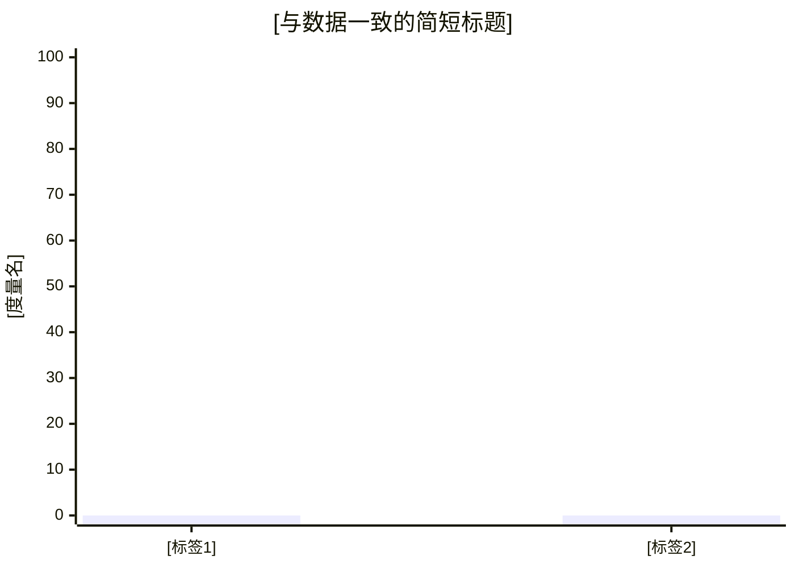

# 单次 SQL 取数报告模板（`sql_query`）

> 规范见 [`../references/smart-reporting.md`](../references/smart-reporting.md)「B. 单次 SQL 取数报告框架」及「sql_query『数据与证据』排版模板」。仅消费 `smart-ask-data` 交付；**不**新增取数；表格优先。  
> 总编排：[`../SKILL.md`](../SKILL.md)

**场景**：`sql_query`  
**上游**：`smart-ask-data` 最终交付（`kn_id`、SQL 原样、结果原样、最小口径）  
**业务 KN**：`[kn_id_ask_data]`

---

## 1. 报告摘要

- **用户问题**：[复述]
- **取数范围（与 SQL 一致的一句话）**：[如：全库关联 / 时间窗 / 分组维度]

---

## 2. 口径卡片（必须）

| 项 | 与 SQL/输入一致 |
| --- | --- |
| 时间范围 | [以 WHERE 为准，或「未限制」] |
| 主体与过滤 | [表、JOIN、过滤条件] |
| 粒度与分组 | [GROUP BY 字段] |
| 指标口径 | [聚合字段与别名] |

---

## 3. 数据与证据

本节内**连续排版**：SQL → 结果表 →（可选）图注 →（可选）Mermaid → **本节结束**。禁止把图挪到「结果解读」之后。

##### SQL（原样）

```sql
-- [粘贴 smart-ask-data 返回的 SQL，一字不改]
```

##### 结果数据（原样）

| [列名与输入一致] | … |
| --- | --- |
| [逐格与输入一致] | … |

（若仅展示前 N 行：须注明总行数或是否截断，且仅当输入可确定。）

[下图与上方结果表逐点一致，数值未做额外加工。]



（将 `x-axis` / `bar` 替换为与上表一致的原文标签与数值；无合适数值结构则删除整段 Mermaid。）

---

## 4. 结果解读（受限解读）

- **允许**：描述性总结（排序、Top、占比读数），且每条可回指上表。
- **禁止**：无对比期/无更多维度时的归因、趋势断言、业务优化结论。

[要点列表]

---

## 5. 结论（仅基于本次结果）

1. [可复核结论，引用具体单元格或行]
2. […]

---

## 6. 限制（必须）

- [时间/过滤/维度缺失]
- [COUNT 与 DISTINCT 语义若未在 SQL 体现须说明]

---

## 7. 下一步（可选）

- [需新增哪些查询/字段；不执行，仅列需求]

---

## 8. 附录：字段字典/候选表 B′（可选）

[仅表/字段索引；**不重复**「3. 数据与证据」中的 SQL]
