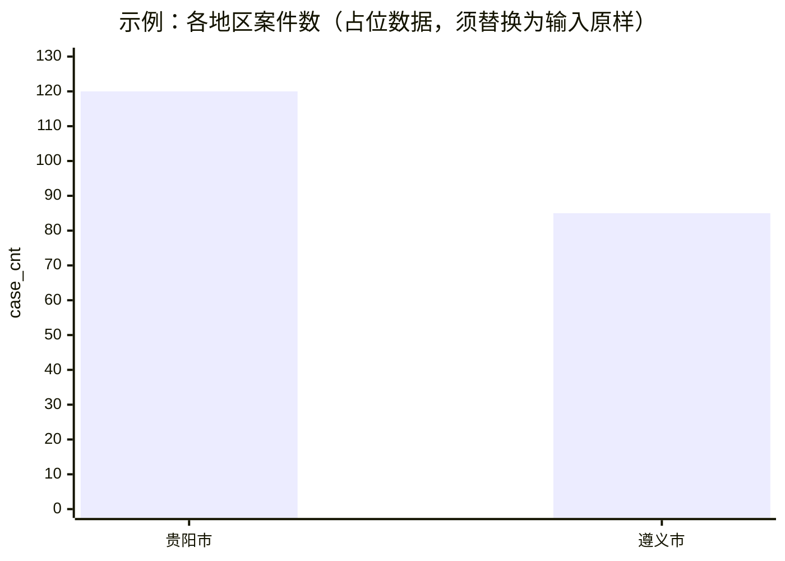
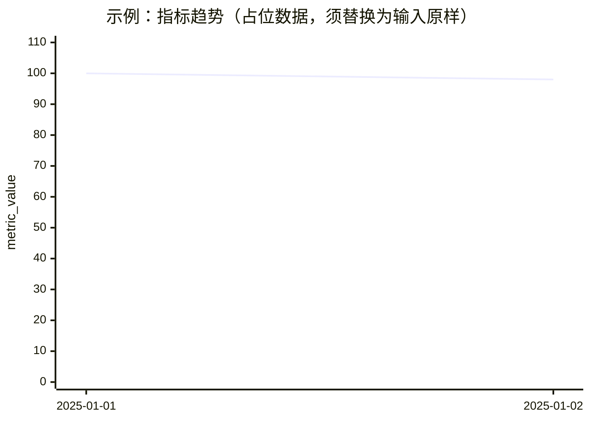

# smart-reporting（独立数据分析报告）

> **维护说明**：本文为报告子技能**完整正文**（在此目录统一维护）。**总编排入口**：[`../SKILL.md`](../SKILL.md)。

本 skill 的定位是：**把“找表结果 / 单次取数结果 / 数据洞察 / 归因分析 最终交付”写成一份可交付、可复核的报告**。它**不执行**任何检索、SQL或代码计算；**只消费输入**（即你已经从 `smart-search-tables` / `smart-ask-data` / `smart-data-insights`（含 **归因分析**子场景证据包）拿到的结果。

你可以把它理解为一个“报告写作层”：

- 输入：来自 `smart-search-tables` / `smart-ask-data` / `smart-data-insights` 的 **原始输出**（含表清单、职责要点、SQL、结果集、子问题证据、洞察结论、**归因证据包**等）
- 输出：针对对应场景的一份**标准结构报告**（含“证据引用”与下一步建议）
- 保存为文件：需要把markdown格式的报告保存为文件，请务必遵守`archive-protocol`技能的约定进行生成物的归档（路径、命名、覆盖策略、索引更新等以该协议为准）

> 参考原则：本 skill **不具备**多子问题取数与归因编排能力；它只能基于“已给定的输出证据”写报告（包括归因分析已交付的多子问题证据）。报告内容必须基于真实数据，不能在没有数据支撑的情况下编造报告内容。

**与总编排的关系**：数据类任务的 **意图路由、KN 分域**，以及「上游完成最终交付 → **立刻** 调用本 skill」的 **自动交接（MUST）** 约定，见 [../SKILL.md](../SKILL.md)（例如：找表成功后场景 `table_search`、问数成功后 `sql_query`、洞察交付就绪后场景 `data_insights`；其中若洞察包含**归因分析证据包**并需按归因报告框架排版，则在 `data_insights` 下启用其归因报告子场景/变体 `attribution_analysis_report`）。其中「立刻」= **同一 assistant 回复内** 在上游交付之后继续输出本 skill 的报告章节，**禁止**要求用户再发一条消息才撰写报告。宿主 Agent 可按该文档中的 **`/smart-reporting` 输入模板** 作为 slash/对内标注；**禁止**仅在对话里输出成篇“报告体”却未按本文件各场景框架编排（章节、证据链、表格优先等与模板一致），也 **禁止**用模板句代替「同答已写出的完整报告」。

---

## 编排流程（全局序号连续；承接上游「最后已完成步」之后）

## 📋 任务进度清单（阶段：报告）

- [ ] 待完成 · 步骤一（识别报告场景，全局第 S+1 步）
- [ ] 待完成 · 步骤二（校验输入完整性，全局第 S+2 步）
- [ ] 待完成 · 步骤三（整理证据与口径，全局第 S+3 步）
- [ ] 待完成 · 步骤四（生成标准报告结构，全局第 S+4 步）
- [ ] 待完成 · 步骤五（证据可复核校验，全局第 S+5 步）
- [ ] 待完成 · 步骤六（输出最终报告，全局第 S+6 步）
- [ ] 待完成 · 步骤七（输出流程完成态）

报告子技能固定包含 **6 个进度步**（工作内容见下表「报告步内容」）。在进度里展示的**全局步号不是固定 5–10**，而是由**进入本 skill 之前**编排中最近一次「已完成第 S 步」的 **S** 决定：

- 令 **S** = 进入 `smart-reporting` 前，上游已连续完成的**最后一步**编号（须与 [`../SKILL.md`](../SKILL.md) 约定的全会话连续编号一致）。
- 本分支输出进度时使用 **第 S+1 步** 至 **第 S+6 步**（共六步）；不得从第 5 步起算，除非当前 **`S = 4`**（例如仅完成总入口门禁、且用户已自备可报告证据等少见情形）。

**常见衔接（举例）**

| 上游结束的步（S） | 报告进度步号（S+1 … S+6） |
| --- | --- |
| 4（仅总入口后直出报告，少见） | 5 … 10 |
| 11（`smart-search-tables` 已结束于第 11 步） | 12 … 17 |
| 12（`smart-ask-data` 已结束于第 12 步） | 13 … 18 |
| 其它 S（如解读等子流程之后） | S+1 … S+6 |

下表为**报告步内容**（与全局数字无关；实现时把「报告第 k 步」映射为「全局第 S+k 步」，k=1…6）：

| 报告内顺序 | 步骤内容 |
| --- | --- |
| 1 | 识别报告场景（`table_search` / `sql_query` / `data_insights`；其中 `attribution_analysis_report` 为 `data_insights` 的归因报告子场景） |
| 2 | 校验输入完整性（缺失即终止并返回补齐清单） |
| 3 | 整理证据与口径（保持可复核） |
| 4 | 生成标准报告结构（按场景模板） |
| 5 | 证据可复核校验（数字、条目、引用一致性） |
| 6 | 输出最终报告 |

进度模板（将 `N` 替换为当前实际全局步号）：

- `## 📋 任务进度清单（阶段：报告）`
- `- [ ] 已完成 · 步骤N（步骤名称）`
- `- [ ] 待完成 · 步骤N+1（步骤名称）`

流程结束输出（**最后一环为第 S+6 步**）：在任务进度清单中标注“步骤 S+6（输出最终报告）已完成”，并追加“流程完成”。

示例：接在问数之后（S=12）：

```text
## 📋 任务进度清单（阶段：报告）
- [x] 已完成 · 步骤13（识别报告场景）
- [ ] 待完成 · 步骤14（校验输入完整性）
...
- [x] 已完成 · 步骤18（输出最终报告）
- [x] 已完成 · 流程完成
```

### 输出要求（最小集合）

1. 报告摘要  
2. 口径卡片 / 检索范围  
3. 数据与证据（SQL 原样 + 结果原样，优先表格）  
4. 结果解读 / 归因结论（仅基于证据）  
5. 限制与下一步  
6. 可选附录（证据索引、候选表索引）
7. 若需落盘为 md 文件，按 archive-protocol 归档

---

## 能力边界（MUST）

- **单次回复闭环（与总编排一致）**：由 `smart-data-analysis` 触发的 **找表/问数/洞察/归因 + 报告** 链路中，本 skill 的输出须出现在 **产生上游最终交付的同一 assistant 回复** 的后续段落；**不得**以「请用户下一回合粘贴 `/smart-reporting …`」作为交付终态。
- **归档与存盘（MUST）**：若用户要求“生成报告/文件/落盘/存盘”等交付形态（例如将 Markdown 报告保存为 `.md` 文件），必须遵守 `archive-protocol` 技能的约定进行生成物归档（路径、命名、覆盖策略、索引更新等以该协议为准）。
- **标题括号注释禁止输出（MUST）**：报告模板中小标题后面的括号内容仅为技术性说明（如「口径卡片（必须）」中的「（必须）」），**对用户的最终报告正文禁止输出括号及其中内容**；仅输出括号前的小标题文本。
- **章节必须写满（不得用引用句替代）**：报告的**每个章节**必须有**实际正文内容**与必要的表格/要点，**不允许**用「同撰写报告之前的输出的某一部分内容」「见上文/同上/略」等方式把章节简化成引用句来“占位”。若某章节确因输入证据不足而无法给出业务结论，必须在该章节内写明 **「不适用/不可判定」**、原因与**最小补数建议**（仍需满足本文件各场景框架的章节顺序与最小集合）。
- **仅用输入写报告**：不得新增任何“表/字段/数据/结论”。
- **不做取数**：不得调用 `smart-search-tables`、`smart-ask-data`、`text2sql`、`execute_code_sync`、`json2plot` 或任何等价取数/加工工具。
- **证据可复核**：报告中出现的每个关键数字/表项，必须能在输入中定位到（SQL、结果行、表路径、UUID、职责条目等）。
- **Mermaid 图表（可选）**：仅当输入中已有**可映射为图表轴与序列的明确数值**时，可在报告中增加 Mermaid 图；**图中每个数据点**必须与输入中的某行/某字段一致，**禁止**补空月、补零、外推、重采样或“合理推测”未出现在输入中的数字；**禁止**将图单独成章置于「结论」「风险」「附录」之后或编排上等价的「取数交付」区块之外。细则见下文「Mermaid 图表（可选，仅基于输入）」。

### 呈现形式（MUST：表格优先）

- **默认**：凡可在不丢失信息的前提下展平为行列表的**取数结果、子问题结果、口径卡片中的枚举项、对比读数、证据索引、候选资产清单**等，在报告**正文**中**优先**使用 Markdown **表格**（含表头），单元格值与输入/SQL 结果**逐字一致**，禁止为排版美观改写数值或合并行导致不可复核。
- **「结果数据（原样）」**：若上游交付为 JSON 数组（或等价行列表），生成报告时应**转换为**与输入**逐行、逐列一致**的 Markdown 表格呈现；SQL 仍须单独放在代码围栏内保持原样。**仅当**（a）结构深层嵌套无法无损展平为二维表，或（b）单元格内超长文本导致主文表格严重不可读时，可保留 fenced JSON 作为主证据，并须在表前或表旁**一句话说明未转表原因**；若正文已用表格完整呈现，JSON 可移至**附录**并标注「与上表等价，便于机器复核」。
- **避免重复**：同一结果集**不要**在正文用「大段 JSON + 同内容表格」重复占位；**优先单表**；确需双形态时，正文以**表格**为主。
- **与图的关系**：Mermaid 绑图仍以**紧邻其上方的表格**（或经上条批准的 JSON）为唯一数值来源；图注须写清与表中哪些列对应。

---

## 输入契约（四类场景）

### 场景 A：找表/找数报告（`table_search`）

输入应来自 `smart-search-tables` 的最终交付，至少包含：

- **runtime_ready 摘要**（可选，建议）：`base_url`、`user_id`、token 状态（不需要也不允许提供完整 token）
- **候选表/视图列表**：每条必须能追溯到 `query_object_instance` 返回，且同时具备：
  - UUID（实例 id / `view_uuid` 等价字段）
  - 技术名称（`view_tech_name` / `table_tech_name`）
  - 业务名称（`view_business_name` / `table_business_name`）
- **（可选）职责要点**：来自 `department_duty_query` 的文本或要点
- **用户原始问题**（推荐）：用于写报告背景与范围

> 若输入中候选表缺少 UUID/技术名/业务名之一，本 skill 必须在报告中标注“信息不完整，无法作为可复核资产条目”并将其归入“待补充”而非“已确认”。
> **图表**：找表交付通常**无**可直接绑图的数值指标；若输入中**未**包含可用于绑图的统计字段（例如某接口返回的命中数、分桶计数等），则**不得**为“资产条目数”以外的事项绘制 Mermaid 数据图。若仅有表清单而无任何输入内数值，可省略图表；若有可结构化数字，**优先**用 **Markdown 表格** 呈现后再考虑绑图。

### 场景 B：单次 SQL 取数报告（`sql_query`）

输入应来自 `smart-ask-data` 的最终交付，至少包含：

- **kn_id**（业务取数 KN）
- **SQL（原样）**
- **结果数据（原样）**：上游可为表格或 JSON；写入本 skill 产出报告时，**正文优先**整理为 Markdown **表格**（与输入逐格一致），例外见上文「呈现形式（MUST：表格优先）」
- **最小口径**：时间范围、过滤条件、分组/排序等（若输入未给，本 skill 只能从 SQL 与结果字段中“复述”，不得凭空补业务含义）
- **（可选）候选表 B′**：若输入含筛选后的相关表列表

> 若输入缺失 SQL 或缺失结构化结果，本 skill 必须终止并给出“补齐输入清单”，不得编造 SQL/结果。
> **图表**：以 `smart-ask-data` 返回的**结构化结果集**为唯一绑图数据源；报告正文已将该结果整理为 Markdown **表格**时，图紧跟该**表格**（若正文保留 JSON 为例外，则紧跟 JSON，仍须说明与表等价关系）。在报告结构中，Mermaid **必须**写在 **「3. 数据与证据」同一节内**，顺序固定为：**SQL（原样）→ 结果数据（原样，优先表）→（可选）Mermaid**，即图紧跟在**刚展示完的那份**结果表（或经批准的 JSON 块）**的下一段**；**不得**把可视化挪到「结果解读」「结论」之后，也不得在全文末尾单开「可视化」「附录图表」等独立成章。图旁须用一句话说明横轴/纵轴/扇区对应哪些字段及是否存在输入内可验算的加总。

---

### 场景 C：归因分析报告（`attribution_analysis_report`）

输入应来自 **`smart-data-insights` 归因分析子场景**（[`attribution_analysis.md`](attribution_analysis.md)）的最终交付原文，或与该形态 **同构** 的归因证据包（你可以理解为“归因分析链路已完成取数与可选出图，`smart-reporting` 只负责把它写成标准报告”），至少包含：

- **口径卡片**：指标定义、主体范围、时间窗口、本期/对比期、粒度、异常阈值（若归因分析输出已给）
- **子问题清单（MECE）**：每个子问题至少包含：
  - 子问题编号/标题
  - **SQL（原样）**
  - **结果数据（原样）**（报告正文优先 Markdown **表格**；与输入逐行一致）
- **结论与建议**：归因分析输出的根因结论与建议（必须能回指到某个子问题证据）

> 本 skill 在该场景下仍 **不做取数**、不调用任何工具；它只做“报告写作与组装”。若输入缺失关键证据（例如只有结论没有 SQL/结果），本 skill 必须指出“证据不完整，无法复核”，不得补造。
> **图表（Mermaid，可选）**：若归因分析输出中已给出结构化数值表或 JSON，本 skill 应先将子问题结果整理为 Markdown **表格**（优先），再用 Mermaid 复画为辅助图，且必须满足：**图紧跟其依据的表**（或经「呈现形式」批准的 JSON）、每个点可逐行核对、不得补点/外推。

---

### 场景 D：数据洞察报告（`data_insights`）

输入应来自 `smart-data-insights` 的最终交付原文（你可以理解为“洞察链路已完成：子场景识别 → 子问题拆解 → 取数证据 → 洞察正文；`smart-reporting` 只负责写成标准报告”），至少包含：

- **用户原始问题**（或可等价复述的背景描述）
- **子场景清单**：`data_interpretation` / `dimensional_analysis` / `contrastive_analysis`（可多选；以输入为准，不得新增/删改）
- **口径卡片（最小集合）**：时间范围/主体范围/过滤条件/粒度/对比期（若有）
- **证据包（必须可复核）**：按“子场景 → 子问题”组织，每个子问题至少包含：
  - 子问题编号/标题（或等价标识）
  - **SQL（原样）**
  - **结果数据（原样）**（报告正文优先 Markdown **表格**；与输入逐行一致）
  - （可选）用到的数据表/视图标识（如 dataview_id、`meta_table_name`、表业务名/技术名等；若输入给出则引用）
- **洞察结论（必须回指证据）**：来自 `smart-data-insights` 的结论/解读/对比读数/建议（必须能回指到某个子问题证据；本 skill 不得补造新的洞察）

> 本 skill 在该场景下仍 **不做取数**、不调用任何工具；它只做“报告写作与组装”。若输入缺失关键证据（例如只有结论没有 SQL/结果，或只有口径没有证据包），本 skill 必须指出“证据不完整，无法复核”，不得补造。
> **图表（Mermaid，可选）**：若洞察交付中已给出结构化数值表或 JSON，本 skill 应先将子问题结果整理为 Markdown **表格**（优先），再用 Mermaid 复画为辅助图；并严格遵守「Mermaid 图表（可选，仅基于输入）」的位置与逐点可核对约束（图紧跟其依据的表/JSON、不得补点/外推）。

## Mermaid 图表（可选，仅基于输入）

本 skill **不调用** `json2plot` 等出图工具；若需可视化，使用 Markdown 代码块 **` ```mermaid `** … **` ``` `** 嵌入 Mermaid 源码，且**全部数据点**来自 `smart-search-tables` / `smart-ask-data` / `smart-data-insights`（含子场景 `attribution_analysis_report` 的输入证据）的输入原文可复核。

### 何时加入图表（位置硬约束）

| 场景 | 位置（MUST） | 前提条件 |
| ---- | ------------- | -------- |
| `sql_query` | **仅**在「**数据与证据**」节内：紧接 **「结果数据（原样）」** 的 Markdown **表格**（优先；例外见「呈现形式」）或 fenced JSON **之后**、**「结果解读」之前**；与 SQL、结果表构成连续证据链，**禁止**插在摘要、口径卡片之后单独成节，也**禁止**放在结论/风险/附录之后 | 结果集为若干行、每行至少一个**数值型度量**列，且分类轴标签来自输入中的字符串/日期字段原文 |
| `table_search` | 紧接**产生该统计数字**的正文块之后（例如某段「命中数/分桶」**表格**的下一段）；**禁止**作为报告最后一节单独成章，除非最后一节本身就是该统计表 | 输入中必须已存在与图一一对应的数字；**不得**用“表数量”以外的臆测指标画图 |
| `attribution_analysis_report` | **仅**在「**4. 数据与证据**」内、**按子问题分段**呈现时：每个子问题的 **「结果数据（原样）」** 的 Markdown **表**（优先）或 fenced JSON **之后**、该子问题的后续文字解读或下一子问题小节之前；与对应 **SQL（原样）**、结果表构成连续证据链；**禁止**把所有子问题的图集中到文末、**禁止**插在摘要/口径卡片/子问题总表之后单独成章，也**禁止**放在「归因结论」「影响范围」「建议」「附录」之后 | 每个待绑图的子问题结果集中，至少满足与 `sql_query` 相同的可绑图条件（数值型度量列 + 轴标签来自输入原文）；多子问题时可一子问题一图，须与**该子问题**刚展示的结果块相邻 |
| `data_insights` | **仅**在「**数据与证据**」节内、**按子场景/子问题分段**呈现时：每个子问题的 **「结果数据（原样）」** 的 Markdown **表**（优先）或 fenced JSON **之后**、该子问题的后续文字解读或下一子问题小节之前；与对应 **SQL（原样）**、结果表构成连续证据链；**禁止**把图挪到「洞察结论/建议/限制/附录」之后，也**禁止**集中到文末单开「可视化」章节 | 与 `sql_query` 同：结果集中包含可绑图的数值型度量列，且轴标签来自输入原文；若输入结果已截断，图仅反映已给行并声明 |

**MUST NOT（位置）**：不得使用「## 可视化」「## 附录：图表」等标题把 Mermaid 与对应数据表**拆开**到相隔很远的章节；若用户交付形态中「取数交付」已含 SQL+表，报告里对应小节必须**同序嵌套**图于表下。

### 允许与禁止（MUST / MUST NOT）

- **MUST**：图中出现的每个数值，在输入结果集中**有明确来源**（单行字段值，或对多行按**显式写出**的同一聚合规则与 SQL 语义一致的加总，且该加总仍可从输入逐行验算）。
- **MUST**：轴标签尽量使用输入中的**原文字符串**（过长时可截断，但须在图注说明“标签已截断，完整字符串见结果表第 x 行”）。
- **MUST**：若结果在输入中已被截断（仅前 N 行），图表只能反映**已给出的行**，并在图注声明“基于输入截断后的结果，非全量”。
- **MUST NOT**：编造、估算、插值、对未返回的时间点补零、合并输入未出现的分类。
- **MUST NOT**：把 `pie` 的占比画成与输入数值不一致的百分比（`pie` 若用，扇区值须直接来自输入字段或可验算的聚合）。
- **MUST NOT**：因 Mermaid 限制而“顺手改数”（例如为美观调整柱高）；若 Mermaid 语法无法表达输入结构，**省略图表**或拆成多张**单序列**图，不得扭曲数据。

### 生成 Mermaid 图的语法与结构限制（实现提示）

- **柱形/折线**：优先使用 **`xychart-beta`** 的 `bar [...]` / `line [...]`；`x-axis` 与数组顺序必须严格对应结果排序（默认与输入结果集顺序一致，除非 SQL 已 `ORDER BY` 且结果集体现该顺序）。
- **多序列分组柱**（如「每月 × 多类型」）：`xychart-beta` **通常仅支持单条 `bar` + 可选 `line`**；若输入为多维度交叉表，应**拆成多张单序列图**（每张图标题写清维度切片，如“仅虚假宣传”），或**仅画输入已给出的单一聚合**（例如对结果按某列分组求和，且验算过程可在报告用一行文字说明）。
- **饼图**：仅当输入各行可解释为**同一总量下的组成部分**时使用；若语义不明确（多行非互斥），不要用 `pie`。
- **渲染兼容性**：`xychart-beta` 依赖 Mermaid 版本；若担心渲染失败，**主要证据仍以 Markdown 表格为准**，Mermaid 作为辅助；仅在无法转表时以 JSON 为主证据。

### 图注写法（建议固定一句）

图紧跟结果表时，在图**前**加一行更贴切：**「下图与上方结果表逐点一致，数值未做额外加工。」**（若绑图依据为经批准的 JSON，改为「与上方 JSON 逐点一致」）。若图不紧跟表（仅排版例外且仍同节），须明确引用「见本节上方结果表」。若做了输入内可验算的加总，改为：**「下图纵轴为对结果集按字段 X 分组对字段 Y 求和，可与上表逐行核对。」**

### sql_query「数据与证据」排版模板（含 Mermaid 图，推荐复制）

生成 `sql_query` 报告时，**「3. 数据与证据」** 一节须按下述**固定顺序**排版（中间**不得**插入「## / #### 可视化」等新大标题；图**不得**挪到本节之后）：

1. 小标题 **`##### SQL（原样）`** → SQL 代码围栏（与输入一致）  
2. 小标题 **`##### 结果数据（原样）`** → **优先** Markdown **表格**（由输入 JSON/行数据转换而来，与输入逐格一致）；仅在「呈现形式」允许的例外下使用 fenced JSON  
3. **空一行（可选）**  
4. **单行图注**：按上文「图注写法」书写（绑图依据为表时默认「下图与上方结果表逐点一致…」；为经批准的 JSON 时用「与上方 JSON…」；有加总验算时用加总说明句）  
5. **Mermaid 围栏**：以 mermaid 语言代码块包裹，**内容仅含上一步表格可核对数值**  
6. **本节在此结束**；下一标题必须是模板中的 **「4. 结果解读」**（或同级后续章节），**禁止**在本节之后再写「## 可视化」「## 附录：图表」等把图与表拆开。

**自检（生成前扫一眼）**：若 Mermaid 图 与「结果数据（原样）」之间隔了「结论」「风险」或其它二级标题 → **版式错误**，须把图**上移**到紧挨结果表之下；若正文能用表却仍以大块 JSON 为主展示 → 违反「表格优先」。

---

## 报告框架与注意事项

**可复制填空骨架**：与下列四套框架一一对应的 Markdown 子模版见 [`../assets/README.md`](../assets/README.md)。

下面给出四套“报告框架 + 注意事项”。你把对应场景的输入贴进来，本 skill 就按该模板生成报告。

### A. 找表/找数报告框架（对应 `smart-search-tables`）

#### 报告结构（推荐固定顺序）

1. **报告摘要**
   - 需求一句话复述（来自用户问题）
   - 本次找到的资产条目数量（仅统计“UUID+技术名+业务名齐全”的条目）
2. **检索范围与证据来源**
   - 输入来源：`smart-search-tables` 的交付结果
   - 使用的元数据 KN（若输入给出）
3. **候选表/视图清单（可复核资产）**
   - **要求尽量用表格呈现**（推荐列：表的业务名称 / 表的技术名称 / 字段业务名称 / 字段的技术名称 / 部门/ 信息系统 / 对应部门职责 / 主题域 )
   - 若输入含路径/库表层级信息、comment 等，可原样放入同一张表，减少零散段落
4. **业务含义与适用场景（基于元数据描述）**
   - **要求尽量用表格呈现**：场景和建议两部分不用表格呈现，对每个“分析场景”给出「涉及到的数据表 + 主要字段」
   - 仅可引用输入中存在的 `comment`、职责文本或字段描述；**禁止**“按表名猜业务口径”
5. **治理与职责要点（如有）**
   - 以“原文摘录/要点引用”的方式呈现，**尽量用表格**：条目（或部门）/ 职责要点 / 证据来源片段
6. **下一步建议**
   - 建议用户如何把问题收敛为可取数的 SQL 问题
   - 或建议用哪张表进一步做问数（仅指向“已找到的表”，不新增）
7. **附录：原始输入摘录（可选但推荐）**
   - 保留关键字段片段（UUID/名称/职责文本引用段）

**关于 Mermaid（找表场景）**：**不**单独列为独立章节。若输入含可绑图的统计表/计数列表，须在**该统计内容所在小节**的结果表或列表**紧下方**插入 Mermaid；若无此类数值则全文不出图。遵守「Mermaid 图表（可选，仅基于输入）」全部 MUST / MUST NOT。

#### 注意事项（MUST）

- **表格优先**：与「呈现形式（MUST：表格优先）」一致；资产清单、职责摘录等已要求尽量用表，生成报告时**避免**用长段落代替可列表化的表。
- **真实性优先**：候选表清单只能来自输入；不得“补全一个看起来合理的宽表名”。
- **缺失即缺失**：任何缺失 UUID/技术名/业务名的条目，不能进入“可复核资产清单”。
- **职责失败不硬绑**：职责信息无法与某条资产一一映射时，必须写“职责为相关部门通用描述/未能与单表绑定”。
- **不要把“建议”写成“结论”**：找表报告的输出是“资产定位结果”，不是“指标结论”。

---

### B. 单次 SQL 取数报告框架（对应 `smart-ask-data`）

#### 报告结构（取数场景，推荐固定顺序）

1. **报告摘要**
   - 问题复述（来自输入或用户原问题）
   - 本次取数范围一句话（严格与 SQL 一致）
2. **口径卡片（必须）**
   - **优先**用 Markdown **表格**汇总：时间范围 / 主体与过滤 / 粒度与分组 / 指标口径等（值须与 SQL 或输入一致；若只能从 SQL 推断为“聚合字段/别名”，则按 SQL 字段名描述，不加业务解释）；条数很少时可用列表，但仍避免散文堆砌
3. **数据与证据**（本节内自上而下连续排版，**不要**拆到后文）
   - **SQL（原样）**
   - **结果数据（原样）**：**优先** Markdown **表格**（与输入逐行一致；由 JSON 转换时不得改值）；仅按「呈现形式（MUST：表格优先）」保留 JSON
   - 若结果行数较多：可在报告正文只展示前 N 行，但必须注明“总行数/是否被截断”（仅当输入里能确定总行数；否则不得捏造）
   - **可视化（Mermaid，可选）**：**紧接**在上一条「结果数据（原样）」展示块**之后**（中间可仅隔一行图注说明，不插入其它小节标题）；若有多张图，均须绑在同一份结果展示之后、**仍在本节内**、**「结果解读」之前**；无合适数值结构则省略。**禁止**把本节图表整体挪到「结论」「风险与限制」「附录」之后或单独成章（例如「## 可视化」放在文末）
4. **结果解读（受限解读）**
   - 允许：对结果集做**描述性总结**（Top、分组对比、占比/排序的“读数”）
   - 禁止：在缺少对比期/未取更多维度的情况下给“归因、趋势判断、优化建议”
5. **结论（仅基于本次结果）**
   - 1～3 条“可复核结论”，每条引用具体数值或分组
6. **限制（必须）**
   - 单次查询局限：时间口径、过滤条件、维度缺失、可能的重复口径等（必须能从 SQL/输入推导）
7. **下一步（可选）**
   - 若要更强结论：列出“需要新增哪几条查询/哪些维度字段”（仅列需求，不执行查询）
8. **附录：字段字典/候选表（可选）**
   - 若输入带 B′ 候选表，可在此复列，便于复核数据来源
   - **附录不需要给出/重复给出 SQL 语句**：SQL 仅应出现在「3. 数据与证据」的 **SQL（原样）** 小节中；附录只做字段/表来源的复核索引

#### 注意事项（取数场景，MUST）

- **表格优先**：取数结果在正文**必须以 Markdown 表格**为主展示（见「呈现形式（MUST：表格优先）」）；SQL 仍单独围栏保持原样。
- **SQL 与结果原样引用**：报告中必须把 SQL 与结果以“原样块”包含进来（或明确引用输入中的对应块）；**结果**以表呈现时，表内数值/字符串仍视为「原样」复述输入。
- **不编造维度含义**：字段名看起来像地区/机构等，也不得自行解释口径，除非输入里已有字段注释/说明。
- **解读必须可复核**：任何“Top1/占比/最大值”都必须能在结果中直接读出（或结果本身已给出占比字段）。
- **不做跨期/趋势**：除非 SQL 与结果已经包含对比期或时间序列字段并返回多期数据。
- **Mermaid 与解读一致**：若文中写「最大/最小/合计」等读数，图中数据须与上文原样结果及该读数**相符**，不得自相矛盾；图仅为输入的另一种呈现，不新增结论。
- **Mermaid 位置**：图必须出现在「数据与证据」内、对应结果表/JSON **正下方**；「结果解读」及之后各节**不得**再重复放同一张绑图（可文字引用「见上文数据与证据中的图」）。

---

### C. 归因分析报告框架（对应 **`smart-data-insights` 归因分析 `attribution_analysis` 子场景** 完成取数后的“报告生成/组装输出”）

> 说明：归因取数编排已并入 `smart-data-insights`作为一个子场景（见 [`attribution_analysis.md`](attribution_analysis.md)）；本节在 `smart-reporting` 中仅做**写作与组装**（不取数、不出图工具调用）。

#### 报告结构（归因分析报告，推荐固定顺序）

1. **报告摘要**
   - 问题复述（来自输入）
   - 一句话结论（来自输入结论，但必须指向证据编号）
2. **口径卡片（必须）**
   - **优先**用 Markdown **表格**列出：指标定义 / 主体范围 / 时间窗口（本期+对比期）/ 粒度 / 异常阈值（均以输入为准，不得补造）
3. **分析路径与子问题清单（必须）**
   - 用表格列出子问题：编号 / 子问题目标 / 对应表（如输入给出）/ 输出指标 / 证据位置索引
4. **数据与证据（必须，按子问题逐个呈现）**
   - 对每个子问题固定顺序：
     - **SQL（原样）**
     - **结果数据（原样）**：**优先** Markdown **表格**（与输入逐行一致）；仅按「呈现形式（MUST：表格优先）」使用 JSON
     - （可选）图表或 Mermaid：**必须紧跟结果数据之后**
   - 子问题之间用小标题或编号分隔；禁止把所有图挪到文末集中展示
5. **归因结论（1–5 条根因，必须可验证）**
   - 每条根因必须引用：子问题编号 + 结果行/数值/图表读图要点（均来自输入证据）
6. **影响范围（基于数据）**
   - 贡献最大的城市/品类/渠道/商品/用户群等（仅当输入证据包含这些维度与数值）
7. **建议（立即/中期/长期）**
   - 每条建议必须能对应某条根因（写清“对应根因 #x”）
8. **附录：证据索引（推荐）**
   - 子问题编号 → SQL/结果/图表在报告中的位置（页内锚点/小节标题即可）
   - 附录可复列“使用到的表/视图清单、关键字段”，但不得新增未在输入出现的对象

#### 注意事项（归因分析报告，MUST）

- **表格优先**：口径卡片、子问题清单、各子问题「结果数据」及可读性强的对比读数，**优先** Markdown **表格**（见「呈现形式（MUST：表格优先）」）。
- **证据可复核**：任何根因/影响范围/建议的“依据数字”，必须能在输入的 SQL/结果/图中定位到。
- **不代替编排取数**：若用户要新增子问题取数或重跑口径，应该回到总入口路由的 `smart-data-insights`（归因子场景）与 `smart-ask-data` 执行层；本 skill 不做。
- **图表位置同规**：若用 Mermaid 复画，仍必须“表下紧跟图”，不得在结论/附录之后再放图。

---

### D. 数据洞察报告框架（对应 `smart-data-insights`，场景 `data_insights`）

#### 报告结构（洞察场景，推荐固定顺序）

1. **报告摘要**
   - 问题复述（来自输入或用户原问题）
   - 本次洞察覆盖的子场景（以输入为准：`data_interpretation` / `dimensional_analysis` / `contrastive_analysis`）
   - 1～3 条“可复核要点”（每条必须引用某个子问题证据编号/小节）
2. **口径卡片（必须）**
   - **优先**用 Markdown **表格**汇总：时间范围 / 主体与过滤 / 粒度与分组 / 对比期（如有）/ 指标口径等（值须与输入证据一致；不得补造业务解释）
3. **分析路径与子场景-子问题清单（必须）**
   - 用表格列出：子场景 / 子问题编号/标题 / 对应表或视图（若输入给出）/ 输出指标 / 证据位置索引
4. **数据与证据（必须，按子场景→子问题逐个呈现）**
   - 对每个子问题固定顺序：
     - **SQL（原样）**
     - **结果数据（原样）**：**优先** Markdown **表格**（与输入逐行一致）；仅按「呈现形式（MUST：表格优先）」使用 JSON
     - （可选）Mermaid：**必须紧跟结果数据之后**，且仍在本节内、在任何解读文字之前
   - 子问题之间用小标题或编号分隔；禁止把所有图挪到文末集中展示
5. **洞察结论与建议（仅复述输入洞察，必须可回指证据）**
   - 按子场景分段输出：每条结论/建议都必须引用对应子问题证据编号或报告小节
   - 禁止：新增未在输入出现的指标、趋势外推、归因补造
6. **限制与不确定性（必须）**
   - 仅可基于输入证据指出：口径缺失、对比期缺失、结果截断、维度缺失、样本代表性等（必须能从输入/SQL 推导）
7. **下一步（可选）**
   - 若需更强结论：列出“需要新增哪几条查询/哪些维度字段/哪类对比期”（仅列需求，不执行查询）
8. **附录：证据索引（推荐）**
   - 子场景/子问题编号 → SQL/结果/图在报告中的位置（页内锚点/小节标题即可）

---

#### 注意事项（洞察场景，MUST）

- **只做写作与组装**：不得新增洞察、不得替代上游编排补取数；任何结论/建议必须回指输入证据。
- **表格优先**：口径卡片、子问题清单、各子问题结果数据、可读性强的对比读数，**优先** Markdown **表格**（见「呈现形式（MUST：表格优先）」）。
- **证据可复核**：任何“Top1/占比/最大值/同比环比差异”等读数，必须能在对应子问题结果中直接读出或逐行验算。
- **Mermaid 位置同规**：图必须出现在「数据与证据」内、对应结果表/JSON **正下方**；「洞察结论与建议」及之后各节**不得**再放同一张绑图（可文字引用「见上文数据与证据中的图」）。

## 报告范例（你可直接复用格式）

下面范例用于说明“格式与写法”。其中表名/UUID/SQL/结果均为**示例占位**，真实执行时必须完全来自输入。

### 范例 1：找表/找数报告（table_search）

#### 报告摘要（找表示例）

用户诉求：定位“企业行政处罚相关数据（案件数、处罚决定书、违法类型、处罚日期等）”对应的数据资产与治理线索。  
本次输出：确认可复核资产 3 条（均具备 UUID + 技术名 + 业务名）。

#### 检索范围与证据来源

- 输入来源：`smart-search-tables` 最终交付（含对象实例检索 +（可选）职责查询输出）
- 元数据证据：候选表/视图记录（UUID、技术名、业务名）

#### 候选表/视图清单（可复核资产）
- 按照部门和信息系统（如果有）来组织结果，比如：

| 部门 | 信息系统 | 业务名 | 技术名 | UUID |
| --- | --- | --- | --- | --- |
| 睢水县 |  | 睢水县人社局_睢河街道灵活就业人员企业养老保险参保登记 | `ssxrsj_shjdlhjyryqyylbxcbdj` | `e452cb96-f4e7-498a-9e49-cdd2c5885f24` |
| 睢水县 |  | 睢水县人社局_魏集镇城乡居民养老保险参保登记 | `ssxrsj_wjzcxjmylbxcbdj` | `668da973-e747-4969-88e9-14bc1fcbb717` |
| 钟吾市人力资源与社会保障局 |  | 钟吾市人社局_机关事业单位养老保险费退费申请 | `zwsrsj_jgsydwylbxftfsq` | `0765c4fd-e6f1-42cd-ba48-95b78230962d` |
| 钟吾市人力资源与社会保障局 |  | 钟吾市人社局_城乡居民基本养老保险费补缴 | `zwsrsj_cxjmjbylbxfbj` | `e9b3c6a5-4879-49c3-b29b-cb6f46fa9c9d` |

#### 业务含义与适用场景（基于元数据描述）

| 场景（示例） | 涉及到的数据表（技术名） | 主要字段（仅当输入提供字段/注释时填写） | 说明（基于输入 comment/职责文本） |
| --- | --- | --- | --- |
| 行政处罚案件事实查询与统计 | `scjg_case_pub_baseinfo` | （示例占位：真实报告写输入中出现的字段，如处罚日期/金额/违法类型等） | 用于处罚案件事实记录与查询统计 |
| 企业主体维度补充（名称/登记机关等） | `scjg_e_baseinfo` | （示例占位：真实报告写输入中出现的字段，如企业名称/登记机关等） | 用于企业主体维度补充 |
| 严重违法失信名单联动（如有） | `scjg_e_li_illdisdetail` | （示例占位：真实报告写输入中出现的字段） | 用于严重违法失信名单相关维度补充或联动 |

#### 治理与职责要点（如有）

（示例）若输入提供了职责查询文本，建议用表格呈现，并注明来源为职责查询输出：

| 条目/部门 | 职责要点（摘录/要点） | 证据来源片段（原文引用） |
| --- | --- | --- |
| （示例占位） | （示例占位） | （示例占位） |

#### 下一步建议

- 若要“案件数统计/按月趋势/按地区分布”：请明确时间范围、地区维度来源字段，并用 `smart-ask-data` 基于上述主表发起单次 SQL 取数。
- 若要“处罚决定书内容/违法类型 TopN”：先确认违法类型字段口径（以输入的字段注释为准），再提出可执行 SQL 取数问题。

---

### 范例 2：单次 SQL 取数报告（sql_query）

#### 报告摘要（取数示例）

用户诉求：按地区汇总某时间范围内的行政处罚案件数，并给出占比。  
本次结果：返回按地区分组的案件数与占比结果集（以 SQL 与结果为准）。

#### 口径卡片（示例）

| 项 | 与 SQL 一致 |
| --- | --- |
| 时间范围 | 以 SQL 的 `WHERE` 条件为准 |
| 分组粒度 | 地区（以 `GROUP BY` 字段为准） |
| 指标 | 案件数（以 SQL 的聚合表达式为准） |
| 过滤条件 | 以 SQL 的过滤表达式为准 |

#### 数据与证据

##### SQL（原样）

```sql
-- 示例占位：真实报告必须粘贴输入中的原样 SQL
SELECT region, COUNT(*) AS case_cnt
FROM scjg_case_pub_baseinfo
WHERE pendecissdate >= DATE '2025-01-01' AND pendecissdate < DATE '2025-04-01'
GROUP BY region
ORDER BY case_cnt DESC;
```

##### 结果数据（原样）

| region | case_cnt |
| --- | --- |
| 贵阳市 | 120 |
| 遵义市 | 85 |

（由输入 JSON 转表，数值与上游逐格一致。）

##### 可视化（Mermaid，可选；数据与上文结果表完全一致）

下图纵轴为 `case_cnt`，横轴为 `region`，未做额外聚合或补数。



#### 结果解读（受限解读）

- 从结果集中可见，案件数最高的地区为“贵阳市”（`case_cnt=120`），其次为“遵义市”（`case_cnt=85`）。

#### 结论（仅基于本次结果）

1. 案件数 Top1 地区为“贵阳市”（120）。
2. 当前结果为“按地区聚合”的横截面统计，不包含进一步的违法类型/处罚金额拆解。

#### 限制条件

- 结果是否可代表全量，取决于 SQL 中时间条件与数据完整性；报告不对“未纳入范围的数据”做推断。
- 若地区字段存在缺失/多口径（如编码/名称混用），需要在后续查询中补充字段清洗口径（本 skill 不做清洗）。

#### 下一步

若需要“违法类型 TopN”或“按月趋势”，需要新增 1～2 条查询：

- 按违法类型分组统计（同一时间范围）
- 按月（或日）分组统计趋势（同一时间范围）

---

### 范例 3：归因分析报告（attribution_analysis_report）

#### 报告摘要（归因分析示例）

用户诉求：（示例占位）解释“某指标在本期相对对比期显著下滑”的原因，并给出建议。  
本次输出：基于输入的多子问题证据（SQL+结果+图/表），归纳 1～5 条可验证根因，并给出对应建议（均可回指证据编号）。

#### 口径卡片（示例）

| 项 | 内容（示例占位：真实报告以输入为准） |
| --- | --- |
| 指标定义 | 以输入口径卡片为准 |
| 主体范围 | 以输入为准 |
| 时间窗口 | 本期 vs 对比期（以输入为准） |
| 粒度 | 日/周/月（以输入为准） |
| 异常阈值 | 以输入为准；缺失则标注「阈值待业务确认」但不得补造数值 |

#### 分析路径与子问题清单（示例；真实报告必须来自输入）

| 子问题编号 | 子问题目标 | 输出指标/维度（以输入为准） | 证据位置 |
| --- | --- | --- | --- |
| Q1 | 趋势与异常开始点定位 | 时间序列指标 | 见“数据与证据 / Q1” |
| Q2 | 结构拆解（示例：按地区/渠道/品类之一） | 贡献度/差值/占比 | 见“数据与证据 / Q2” |
| Q3 | Top 下滑项定位（示例：Top 商品/Top 渠道） | TopN 列表 | 见“数据与证据 / Q3” |

#### 数据与证据（按子问题逐个呈现；固定顺序：SQL → 结果 →（可选）图）

##### Q1：趋势与异常开始点定位

###### SQL（原样）

```sql
-- 示例占位：真实报告必须粘贴输入中的原样 SQL（来自归因分析交付）
SELECT dt, metric_value
FROM some_fact_table
WHERE dt BETWEEN DATE '2025-01-01' AND DATE '2025-03-31'
ORDER BY dt ASC;
```

###### 结果数据（原样）

| dt | metric_value |
| --- | --- |
| 2025-01-01 | 100 |
| 2025-01-02 | 98 |

###### 可视化（Mermaid，可选；数据与上文结果表完全一致）

下图横轴为 `dt`，纵轴为 `metric_value`，与上方结果逐点一致，未做额外加工或补点。



##### Q2：结构拆解（示例：按某维度贡献/占比）

###### SQL（原样）

```sql
-- 示例占位：真实报告必须粘贴输入中的原样 SQL
SELECT dim, delta_value
FROM some_breakdown_result
ORDER BY delta_value ASC;
```

###### 结果数据（原样）

| dim | delta_value |
| --- | --- |
| 维度A | -12 |
| 维度B | -5 |

##### Q3：Top 下滑项定位（示例：TopN 列表）

###### SQL（原样）

```sql
-- 示例占位：真实报告必须粘贴输入中的原样 SQL
SELECT item, metric_delta
FROM some_topn_result
ORDER BY metric_delta ASC
LIMIT 20;
```

###### 结果数据（原样）

| item | metric_delta |
| --- | --- |
| 条目1 | -20 |
| 条目2 | -15 |

#### 归因结论（1–5 条根因，必须可验证）

1. （示例占位）根因 #1：……（证据：Q2 的 `dim=维度A` 对应 `delta_value=-12`，见“数据与证据 / Q2”）。
2. （示例占位）根因 #2：……（证据：Q1 在某日期后指标持续下滑，见“数据与证据 / Q1”）。

#### 影响范围（基于数据）

- （示例占位）主要影响维度/Top 下滑项：……（证据：Q3 TopN 结果，见“数据与证据 / Q3”）。

#### 建议（立即/中期/长期；每条建议必须对应根因）

- 立即：（示例占位）……（对应根因 #1）。
- 中期：（示例占位）……（对应根因 #2）。
- 长期：（示例占位）……（对应根因 #1/#2）。

#### 附录：证据索引（推荐）

| 证据编号 | 内容 | 报告位置 |
| --- | --- | --- |
| Q1 | 趋势 SQL + 结果 + 图 | 数据与证据 / Q1 |
| Q2 | 拆解 SQL + 结果 | 数据与证据 / Q2 |
| Q3 | TopN SQL + 结果 | 数据与证据 / Q3 |

## 调用示例

```text
/smart-reporting 场景=table_search；以下是 smart-search-tables 的最终交付结果：<粘贴原文或 JSON>
/smart-reporting 场景=sql_query；以下是 smart-ask-data 的最终交付结果（含 SQL 与结果）：<粘贴原文或 JSON>
/smart-reporting 场景=data_insights；以下是 smart-data-insights 的最终交付结果（含子场景清单/子问题证据/洞察结论）：<粘贴原文或 JSON>
/smart-reporting 场景=attribution_analysis_report；以下是 smart-data-insights（归因分析子场景`attribution_analysis`）的最终交付结果（含口径卡片/子问题证据/结论建议）：<粘贴原文或 JSON>
```

生成报告时：在**不改动证据值**的前提下，**优先用 Markdown 表格**展示结果与可列表化口径（见上文「呈现形式（MUST：表格优先）」）。
